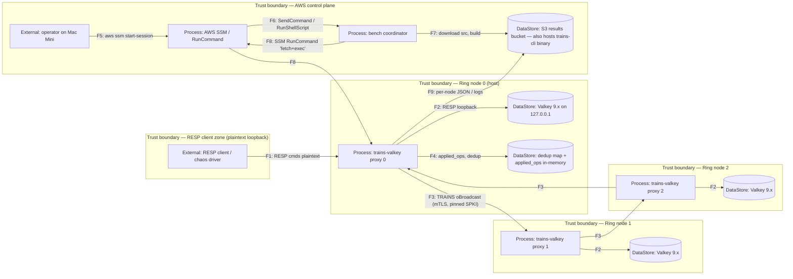

# Threat Model — trains-valkey (STRIDE-per-element)

## 1. Scope

- **Date.** 2026-05-27
- **Reviewer.** AO Threat-Modeller agent — STRIDE-per-element
- **Commit on `main`.** `c80d72f`
- **Paths reviewed.**
  - `bench/reports/paper-trains-replicated-redis-draft-2026-05-26.md` (§3 Design, §4 Implementation, §5 EC2 chaos run)
  - `bench/ARCHITECTURE.md` (AWS bench stack: VPC, SGs, IAM, S3, SSM, VPC endpoints)
  - `crates/trains-valkey/src/proxy.rs` (RESP listener + driver loop, first 200 lines)
  - `crates/trains-net/src/transport.rs` (ring TLS transport, `TCP_USER_TIMEOUT`, `abort()`)
- **Method.** STRIDE-per-element. One row per element in the DFD, one column per applicable STRIDE letter, every populated cell traceable to a `T-tr-NN` statement using the threat grammar
  *"[source] [prereqs] can [action], which leads to [impact], resulting in reduced [goal] of [asset]."*
- **Risk responses.** One per threat: Avoid / Mitigate / Transfer / Accept.

## 2. Assumptions

### 2.1 What Are We Working On (WWWO)

1. trains-valkey is a per-node RESP-level write-interception proxy in front of an unmodified Valkey 9.x engine on `127.0.0.1`.
2. The proxy participates in a TRAINS uniform total-order broadcast ring (currently `RING_SIZE = 3`).
3. The ring transport (`trains-net`) is mTLS over TCP, using `rustls` with the `ring` crypto backend and `PinnedFingerprintVerifier` (SPKI fingerprint pinning, both sides).
4. The deployed AWS bench stack: 3 × `t4g.micro` ring nodes + 1 coordinator in a private VPC (`10.50.0.0/16`), no IGW/NAT, SSM-only access, S3 results bucket, four interface/gateway VPC endpoints.
5. The TRAINS protocol's *abstract* correctness (uniform total-order broadcast + view change) is proven in TLA+ and treated as a primitive.
6. The proxy is the SUT; Redis/Valkey itself is out of scope for modification.

### 2.2 What Can Go Wrong (WCGW) — confirmed posture, NOT findings

1. **The RESP client ↔ proxy boundary currently runs WITHOUT mTLS.** In the bench harness clients connect to the proxy over plaintext loopback. The codebase has no client-side TLS termination today.
2. The ring (proxy ↔ proxy) DOES use mTLS with pinned SPKI fingerprints (this is enforced by `PinnedFingerprintVerifier`).
3. The proxy ↔ Valkey-backend hop is plaintext RESP over `127.0.0.1`, no `AUTH`, no ACL. The trust model relies on Valkey being bound to loopback.
4. Long-term key management (rotation cadence, HSM custody, revocation) is operator-driven and explicitly out of scope; captured here as `OPEN-Q-1`.
5. `Replica::applied_ops` is documented (paper §8) as unbounded — long-running rings will leak memory; this is a known limitation, not a finding.
6. The bench AWS account is single-region (`us-east-1` per ARCHITECTURE.md; the chaos run report references `eu-west-3` — operator discrepancy noted as `OPEN-Q-2`).

## 3. Data-flow diagram

Trust boundaries (TB):

- **TB-A** RESP-client-zone ↔ proxy-host (plaintext today)
- **TB-B** Proxy ↔ proxy (mTLS+pinning enforced)
- **TB-C** Proxy ↔ Valkey-backend (loopback only — relies on host trust)
- **TB-D** Operator ↔ AWS control plane (IAM + SSM)
- **TB-E** CI/operator ↔ S3 binary distribution (signed tarball missing — see T-tr-15)

## 4. STRIDE-per-element coverage matrix

| Element | Kind | S | T | R | I | D | E |
|---|---|---|---|---|---|---|---|
| RESP client (EC) | External | T-tr-01 | — | T-tr-02 | — | — | — |
| Operator host (OP) | External | T-tr-03 | — | T-tr-04 | — | — | — |
| trains-valkey proxy (P0–P2) | Process | T-tr-05 | T-tr-06 | T-tr-07 | T-tr-08 | T-tr-09 | T-tr-10 |
| bench coordinator (CO) | Process | T-tr-11 | — | — | — | T-tr-12 | T-tr-13 |
| Valkey backend (DS0–DS2) | Data store | — | T-tr-14 | — | T-tr-14b | T-tr-09b | — |
| S3 results bucket (S3) | Data store | — | T-tr-15 | T-tr-15b | T-tr-16 | — | — |
| applied_ops / dedup map (FS0) | Data store | — | T-tr-17 | — | — | T-tr-17b | — |
| F1 RESP client→proxy | Data flow | — | T-tr-18 | — | T-tr-18b | T-tr-19 | — |
| F3 ring TLS | Data flow | — | T-tr-20 | — | T-tr-20b | T-tr-21 | — |
| F2 proxy→Valkey loopback | Data flow | — | T-tr-22 | — | — | — | — |
| F8 SSM RunCommand | Data flow | — | — | — | — | T-tr-23 | — |

(`—` = N/A under current threat model.)

## 5. Threat statements

> Format: **T-tr-NN** [STRIDE letter(s)] — *grammar.* Rating.

**T-tr-01** [S] — *An attacker on the same host or with loopback-network access can connect to the proxy's RESP port and send arbitrary writes, which leads to forged client identity (no client auth exists on TB-A), resulting in reduced authenticity of every acked write recorded by the proxy.* **High.**

**T-tr-02** [R] — *A RESP client with malicious intent can issue destructive writes (e.g., `DEL *`-equivalents, set deletions) without leaving any tamper-evident audit record, because the proxy emits only `tracing::debug` logs of connection origin and not signed per-request logs, which leads to inability to attribute post-incident damage, resulting in reduced non-repudiation of client actions.* **Medium.**

**T-tr-03** [S] — *An attacker with the operator's AWS access keys can spoof the operator identity to SSM, which leads to RunCommand execution on ring nodes (download arbitrary binaries, exfiltrate keys), resulting in reduced authenticity of every subsequent ring operation.* **High.**

**T-tr-04** [R] — *The operator can issue an `aws ssm send-command` that mutates ring state with no human-readable per-instance audit beyond CloudTrail's coarse-grained event, which leads to weak forensics on whose run caused which acked-write set, resulting in reduced non-repudiation of bench/operator actions.* **Low.**

**T-tr-05** [S] — *A peer with a stolen private key but unrevoked SPKI fingerprint can rejoin the ring under another node's identity (the `PinnedFingerprintVerifier` pins SPKI only; there is no revocation list), which leads to acceptance of forged ring frames, resulting in reduced authenticity of the total-order broadcast.* **High.**

**T-tr-06** [T] — *A compromised proxy process can craft a `WriteOp` envelope whose `request_id` collides with a victim origin's prior id, which leads to silent drop of the legitimate downstream apply by the at-most-once dedup, resulting in reduced integrity of the replicated state.* **Medium.**

**T-tr-07** [R] — *The proxy logs writes via `tracing::debug` but does not persist a per-`(origin, request_id)` audit log to disk, which leads to inability to reconstruct the order/origin of acked writes after a crash, resulting in reduced non-repudiation of the ring's acked-write history.* **Medium.**

**T-tr-08** [I] — *A reader with access to the host (or to stderr captured by SSM and forwarded to S3) can extract write payloads from the proxy's `tracing` output (`peer`, `argv`), which leads to leakage of plaintext key+value pairs, resulting in reduced confidentiality of client data.* **Medium.**

**T-tr-09** [D] — *An attacker who can connect to the proxy's RESP port can open `CMD_CHANNEL_CAP=256` concurrent connections each issuing a write that hangs the driver's resolve step on `SPOP`-class commands against an empty set, which leads to channel exhaustion on `cmd_tx`, resulting in reduced availability of the proxy.* **High.**

**T-tr-09b** [D] — *A pathological RESP client can flood `SET k_huge v_huge` writes that the proxy faithfully broadcasts, causing the loopback Valkey's working set to exceed RAM, which leads to OOM-killing of the engine, resulting in reduced availability of the local replica.* **Medium.**

**T-tr-10** [E] — *A bug in `effect::resolve` reachable via a malformed `INCRBYFLOAT` payload (e.g., `NaN`, integer overflow) can cause the proxy to broadcast a `SET k NaN` that every replica applies, which leads to corrupted shared state poisoning all survivors, resulting in reduced integrity AND elevated-privilege exposure (an unprivileged RESP client induces ring-wide effects).* **High.**

**T-tr-11** [S] — *An attacker with `s3:GetObject` on `s3://<results-bucket>/bin/trains` can replace the binary between coordinator upload and ring-node SSM fetch, which leads to ring nodes downloading and executing a trojanised binary, resulting in reduced authenticity of the proxy code path itself.* **High.**

**T-tr-12** [D] — *A bug or hostile actor can delete the S3 results bucket between the coordinator's upload and the ring nodes' fetch, which leads to every ring node's bootstrap failing with `403 NoSuchKey`, resulting in reduced availability of the entire bench.* **Low.**

**T-tr-13** [E] — *The coordinator's instance profile grants `ssm:SendCommand` against ring instances by tag filter; an attacker who can write the `Project=trains-bench` tag onto an unrelated EC2 instance in the account can have the coordinator execute arbitrary RunShellScript on that instance, which leads to lateral pivot, resulting in reduced authorisation isolation.* **Medium.**

**T-tr-14** [T] — *A user/process on the proxy host with shell access can `redis-cli -p 6379 FLUSHALL` against the loopback Valkey, which leads to divergence between the local engine and the in-memory `applied_ops` state, resulting in reduced integrity of the replicated state on that node.* **High.**

**T-tr-14b** [I] — *Anything on the host (any process under the same UID, plus root) can `redis-cli -p 6379 KEYS *` against the no-auth loopback Valkey, which leads to disclosure of every replicated key+value, resulting in reduced confidentiality of all client data on that replica.* **High.**

**T-tr-15** [T] — *An attacker with S3 write but no IAM-policy access can overwrite `bin/trains` in the results bucket (binary distribution carries no checksum/signature verification at the consumer), which leads to silent supply-chain substitution, resulting in reduced integrity of the deployed code.* **High.**

**T-tr-15b** [R] — *S3 access logs for the results bucket are not explicitly enabled in `bench/ARCHITECTURE.md`; a `PutObject` on `bin/trains` may not be attributable to a principal post-hoc, which leads to inability to reconstruct who substituted what, resulting in reduced non-repudiation of binary distribution.* **Medium.**

**T-tr-16** [I] — *Per-node JSON reports written to S3 include `argv` of all broadcast writes; an attacker with `s3:GetObject` on `results/<instance-id>/*` (granted to ring-node profiles plus anyone with bucket read) can read those payloads, which leads to leakage of every write that traversed the ring, resulting in reduced confidentiality of client data at rest.* **Medium.**

**T-tr-17** [T] — *`Replica::applied_ops` is in-memory and untrusted-process-modifiable via a process-debugger or `/proc/<pid>/mem` write by the host root, which leads to forced double-apply or skipped-apply of any chosen `(origin, request_id)`, resulting in reduced integrity of the dedup property.* **Low.**

**T-tr-17b** [D] — *`Replica::applied_ops` grows unbounded (paper §8); a sustained-load deployment runs the proxy host out of RAM, which leads to OOM-kill mid-window and a forced view change, resulting in reduced availability under steady-state load.* **Medium.**

**T-tr-18** [T] — *A man-in-the-middle on the loopback interface (a different process bound to the same port via `SO_REUSEPORT`, or an `iptables`-based redirect by a privileged user) can rewrite RESP frames in flight, which leads to applied writes diverging from what the client sent, resulting in reduced integrity of the client-to-proxy flow.* **Medium.**

**T-tr-18b** [I] — *A `tcpdump -i lo` (loopback sniff) on the host captures every RESP write in plaintext, which leads to passive disclosure of all client traffic, resulting in reduced confidentiality of the client-to-proxy flow.* **Medium.**

**T-tr-19** [D] — *An attacker can hold many half-open TCP connections to the proxy's RESP port (Slowloris-style), which leads to listener accept backlog exhaustion (no `tokio` accept-rate-limit is present in `listener_loop`), resulting in reduced availability of the proxy's client port.* **Medium.**

**T-tr-20** [T] — *Despite mTLS+SPKI pinning, a peer with valid identity can craft a `WireMsg::ViewChange` frame that triggers a spurious view change (the `ViewChange` token protocol trusts ring-internal frames), which leads to ring re-formation around a fictitious crash, resulting in reduced integrity of the view-change layer.* **Medium.**

**T-tr-20b** [I] — *The TLS ring transport accepts `bincode`-framed `WireMsg`s of arbitrary size (`CHANNEL_CAP=64` capped, but per-frame size unbounded), allowing a peer to send oversize frames that the framed reader allocates for, which leads to memory blow-up and possible information disclosure via OOM-kill side effects, resulting in reduced confidentiality of the proxy's process memory.* **Low.**

**T-tr-21** [D] — *A peer with a valid identity can sustain a high-rate write storm that exceeds `CHANNEL_CAP=64` on every downstream mpsc and stalls the `mux_task`, which leads to backpressure into the entire ring, resulting in reduced availability of all replicas.* **Medium.**

**T-tr-22** [T] — *A separate process on the host bound to `127.0.0.1:6379` before the proxy (race window during host boot) can pose as Valkey to the proxy and rewrite stored values, which leads to applied writes hitting the wrong backend, resulting in reduced integrity of the local replica.* **Low.**

**T-tr-23** [D] — *AWS SSM `SendCommand` quotas (default 1 000 InProgress invocations / region) can be exhausted by another workload in the same account, which leads to the bench coordinator's `SendCommand` calls being throttled, resulting in reduced availability of the bench orchestration.* **Low.**

## 6. Selected mitigations

> Open-source / already-in-the-tree only. Prefer `rustls`, `socket2`, `rand_core`, and SSM/IAM features over new deps.

| ID | Mitigation | Threats addressed | Implementation notes |
|---|---|---|---|
| M-1 | **mTLS on TB-A (RESP client ↔ proxy).** Reuse `tokio-rustls::TlsAcceptor` + `PinnedFingerprintVerifier` already used on the ring. Wrap `listener_loop`'s accepted socket in a `TlsStream` before passing to `client_loop`. | T-tr-01, T-tr-18, T-tr-18b | `~80 LOC` in `crates/trains-valkey/src/proxy.rs`; reuse existing `NodeIdentity`. |
| M-2 | **Bind Valkey via UNIX socket with `0600` perms, set `requirepass` and ACL.** Drop `127.0.0.1:6379` exposure; use `--unixsocket /var/run/trains/valkey.sock --unixsocketperm 600`. | T-tr-14, T-tr-14b, T-tr-22 | Edit Valkey config in CDK UserData; flip `RedisBackend` connect from TCP to UDS via `tokio::net::UnixStream`. |
| M-3 | **S3 bucket: enable Object Lock + server-side bucket policy denying `s3:PutObject` on `bin/*` to all principals except the coordinator role; enable S3 access logging to a sibling log bucket.** | T-tr-11, T-tr-15, T-tr-15b | Edit CDK `S3Bucket` props: `objectLockEnabled: true`, `serverAccessLogsBucket`. Add `Statement` with `Effect: Deny`, `Principal: *`, `NotResource: arn:.../bin/*` carve-out for coordinator role. |
| M-4 | **Signed-binary verification on ring nodes.** Coordinator signs `bin/trains` with `minisign` (`rsign2` Rust crate is the in-tree-friendly option) or `cosign` keyless; ring-node SSM RunCommand verifies signature before `chmod +x`. | T-tr-11, T-tr-15 | Add a `verify-signature` step to the RunShellScript; ship public key via CDK constant, not S3. ~30 LOC of shell + one new crate (`rsign2`, MIT-licensed, pure Rust). |
| M-5 | **Audit-log writes to disk.** Append-only structured log per `(origin, request_id, ts, argv_hash)` written via `tracing-appender::rolling` (already a `tracing` transitive). Hash `argv` with `blake3` to avoid leaking plaintext to disk. | T-tr-02, T-tr-07, T-tr-15b | ~50 LOC in `proxy.rs` driver loop after broadcast-confirmed delivery. |
| M-6 | **Input validation on `effect::resolve` for `INCRBYFLOAT`/`HINCRBYFLOAT`.** Reject `NaN`, `±Inf`, and overflow via `f64::is_finite()` before formatting; return `-ERR value out of range` to client. | T-tr-10 | ~10 LOC in `crates/trains-valkey/src/effect.rs`. Already-in-stdlib. |
| M-7 | **Listener backpressure: connection-rate-limit + per-IP cap.** Wrap `listener.accept()` with `tokio::sync::Semaphore::new(MAX_CONNS)` and reject (with RESP `-ERR busy`) once exhausted; track per-source-IP counts in a `DashMap`. | T-tr-09, T-tr-19 | ~40 LOC in `listener_loop`. `DashMap` is already in the tree via `tokio` ecosystem; alternative `std::collections::HashMap` behind a `Mutex` works. |
| M-8 | **Frame-size cap on `WireMsg` deserialiser.** Use `bincode::config::Configuration::with_limit::<MAX_FRAME>()` (e.g. 1 MiB) so the framed reader refuses oversize frames pre-allocation. | T-tr-20b, T-tr-21 | ~5 LOC in `crates/trains-net/src/codec.rs`. |
| M-9 | **View-change frame authorisation.** Require the `WireMsg::ViewChange` payload to include a per-view monotonic counter signed via the existing TLS session-bound `tls-exporter` (RFC 5705) value, refusing replays/forgeries from a compromised-but-still-trusted peer. | T-tr-20 | ~60 LOC + dep on `rustls`'s `export_keying_material` (already shipped). |
| M-10 | **Replace tag-filtered `ssm:SendCommand` with explicit instance-id allowlist.** Coordinator's IAM policy `Resource` becomes the `arn:aws:ec2:.../instance/i-...` of the three ring nodes, populated at CDK synth time. | T-tr-13 | CDK edit only; ~10 LOC. |
| M-11 | **Cap `Replica::applied_ops` by `(origin, watermark)` window.** Track per-origin last-applied `request_id` (a `u64`) + a recent-set of K most-recent ids (e.g. 65 536). | T-tr-17b | ~80 LOC in `crates/trains-valkey/src/replica.rs`. Documented in paper §8; closing this is on the v1.1 roadmap. |
| M-12 | **Per-write redaction in `tracing` output.** Default `RESP cmd` events log only the command keyword + `argv_hash`; full `argv` is gated on a `--debug-payloads` CLI flag. | T-tr-08, T-tr-16 | ~20 LOC in `proxy.rs` + a CLI flag. |

## 7. Mitigation bypass analysis

| Mitigation | Plausible bypass | Residual risk |
|---|---|---|
| M-1 mTLS on TB-A | Client cert + private key stolen from a co-located application; or a CA misconfiguration accepts any client. | If pinning is per-fingerprint (matches ring), residual is **Low**. If a CA is introduced, residual climbs to Medium. |
| M-2 UDS + ACL on Valkey | Root on the host bypasses socket perms; `setfacl` errors silently. | **Medium** — root compromise of the host is game over regardless; documented assumption. |
| M-3 S3 Object Lock + bucket policy | Operator with bucket-policy IAM perms can disable Object Lock or rewrite the policy. | **Low** — restrict bucket-policy editing to a separate "admin" role and rotate keys. |
| M-4 Signed binary | Attacker who compromises the coordinator at sign time can sign their trojan with the legitimate key. | **Medium** — couple with M-3 (no S3 write) to defend in depth; or move signing to an offline host. |
| M-5 Audit log | Local-host attacker who deletes the log file before the rotator flushes; or modifies log records pre-flush. | **Low/Medium** — ship logs off-box (CloudWatch Logs via VPC endpoint; cost ~$0.05/GB) to close the local-tamper window. |
| M-6 Float validation | A novel non-deterministic command added later (e.g. `BITCOUNT`-randomised) is untouched. | **Low** — add a test that every new effect resolver is checked by a property-based test (`proptest`). |
| M-7 Backpressure | A botnet with thousands of source IPs defeats per-IP caps. | **Medium** — front the proxy with an AWS NLB + WAF for production deployments (out of bench scope). |
| M-8 Frame-size cap | A peer can send many small frames at rate to achieve the same memory pressure (T-tr-21 is partly orthogonal). | **Low** — combine with M-7-style global semaphore on the wire reader. |
| M-9 View-change auth | A peer still able to sign valid frames can trigger crashes but no longer replay old ones. | **Medium** — closes replay attacks; doesn't close compromised-peer attacks (those need M-PENDING revocation). |
| M-10 Explicit instance-id IAM | A future scale-out forgets to widen the allowlist; falls back to tag filtering. | **Low** — gate IAM template generation behind CDK code, fail synth if instance count ≠ allowlist size. |
| M-11 Bounded dedup | Long-delayed retries past the watermark window double-apply silently. | **Low** — paper §8 already lists this; watermark window of 65 536 ids exceeds any realistic backlog. |
| M-12 Log redaction | Operator forgets to clear `--debug-payloads` before a prod run. | **Low** — refuse to start with `--debug-payloads` set if `--prod` is also set; CI check on `Vec<String>` of forbidden combos. |

## 8. Risk-response plan

| Threat | Strategy | Owner | Trigger to revisit |
|---|---|---|---|
| T-tr-01 | **Mitigate** (M-1) | Ring core | Any non-loopback client config; before v1.0 prod claim. |
| T-tr-02 | **Mitigate** (M-5) | Ring core | First customer regulated workload. |
| T-tr-03 | **Transfer** (AWS IAM + MFA + CloudTrail) | Operator | Operator rotates AWS keys or onboards another principal. |
| T-tr-04 | **Accept** | Operator | If a customer asks for per-run attestation. |
| T-tr-05 | **Mitigate** (M-9 + revocation list — `OPEN-Q-1`) | Ring core | Any operator key-rotation procedure landing. |
| T-tr-06 | **Mitigate** (M-5 hash-pinning) | Ring core | A new origin-resolver lands. |
| T-tr-07 | **Mitigate** (M-5) | Ring core | First post-incident forensics drill. |
| T-tr-08 | **Mitigate** (M-12) | Ring core | Any structured-logging refactor. |
| T-tr-09 | **Mitigate** (M-7) | Ring core | First sustained-load run > 1 k connections. |
| T-tr-09b | **Accept** | Operator | Production sizing review. |
| T-tr-10 | **Mitigate** (M-6) | Ring core | New non-deterministic command lands. |
| T-tr-11 | **Mitigate** (M-3 + M-4) | Operator + CI | Any change to binary-distribution pipeline. |
| T-tr-12 | **Accept** | Operator | Multi-region bench design. |
| T-tr-13 | **Mitigate** (M-10) | Operator | Ring scale-out (N>3) or account-share. |
| T-tr-14 | **Mitigate** (M-2) | Ops | Any move off pure-loopback assumption. |
| T-tr-14b | **Mitigate** (M-2) | Ops | Any move off pure-loopback assumption. |
| T-tr-15 | **Mitigate** (M-3 + M-4) | Operator + CI | Any change to coordinator role. |
| T-tr-15b | **Mitigate** (M-3 access logs) | Operator | Audit drill. |
| T-tr-16 | **Mitigate** (M-12) | Ring core | Customer data-classification requirement. |
| T-tr-17 | **Accept** | Ops | Host hardening review. |
| T-tr-17b | **Mitigate** (M-11) | Ring core | First > 24 h sustained-load run. |
| T-tr-18 | **Mitigate** (M-1) | Ring core | Same trigger as T-tr-01. |
| T-tr-18b | **Mitigate** (M-1) | Ring core | Same trigger as T-tr-01. |
| T-tr-19 | **Mitigate** (M-7) | Ring core | First externally-reachable deployment. |
| T-tr-20 | **Mitigate** (M-9) | Ring core | Any view-change semantics change. |
| T-tr-20b | **Mitigate** (M-8) | Ring core | Same PR as M-8. |
| T-tr-21 | **Mitigate** (M-7-equivalent on wire) | Ring core | First N>3 deployment. |
| T-tr-22 | **Mitigate** (M-2 UDS removes the port race) | Ops | UDS rollout. |
| T-tr-23 | **Accept** | Operator | Account-share with another SSM-heavy workload. |

## 9. Open questions for the next pass

1. **OPEN-Q-1.** Long-term key management — rotation cadence, revocation mechanism (CRL? OCSP? in-band view-change ABORT-NODE?), HSM custody for the SPKI fingerprints. The pinning list is currently a `Vec<SpkiFingerprint>` baked into `RingConfig` at start — no revocation path.
2. **OPEN-Q-2.** Single-region scope — the paper references `eu-west-3` for the chaos run but `bench/ARCHITECTURE.md` says `us-east-1`. Operator to confirm canonical region and document why.
3. **OPEN-Q-3.** Is the `tls-exporter` (RFC 5705) signal accessible from `tokio-rustls`'s `TlsStream`? Confirm before scoping M-9; if not, fall back to a per-view nonce stored in the protocol layer.
4. **OPEN-Q-4.** Should the loopback Valkey require `AUTH` even after the UNIX-socket move? Paper §6.3 assumes "loopback engine, not networked engine"; the threat model would close T-tr-14b further with `requirepass`.
5. **OPEN-Q-5.** Should bench results JSON redact `argv` by default? Today the per-node JSON is uploaded to S3 verbatim, which is the right thing for paper artifacts but the wrong default for customer data.
6. **OPEN-Q-6.** TLS 1.3 cipher suite list — the rustls `ring` provider currently offers `TLS13_AES_256_GCM_SHA384`, `TLS13_AES_128_GCM_SHA256`, `TLS13_CHACHA20_POLY1305_SHA256`. Confirm whether to pin to `TLS13_AES_128_GCM_SHA256` (FIPS-acceptable, lowest CPU on arm64) for the bench, or leave the rustls default.
